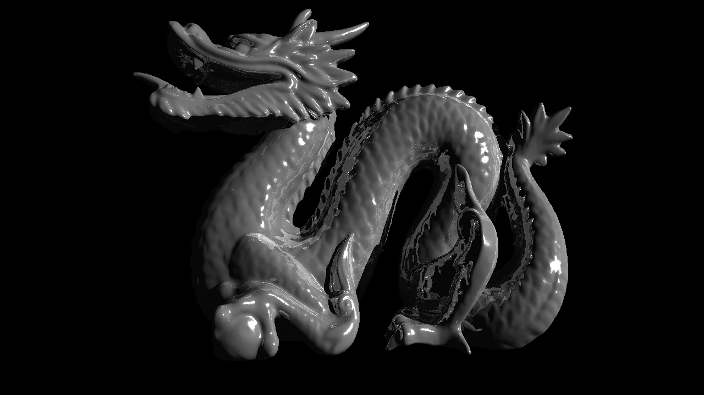
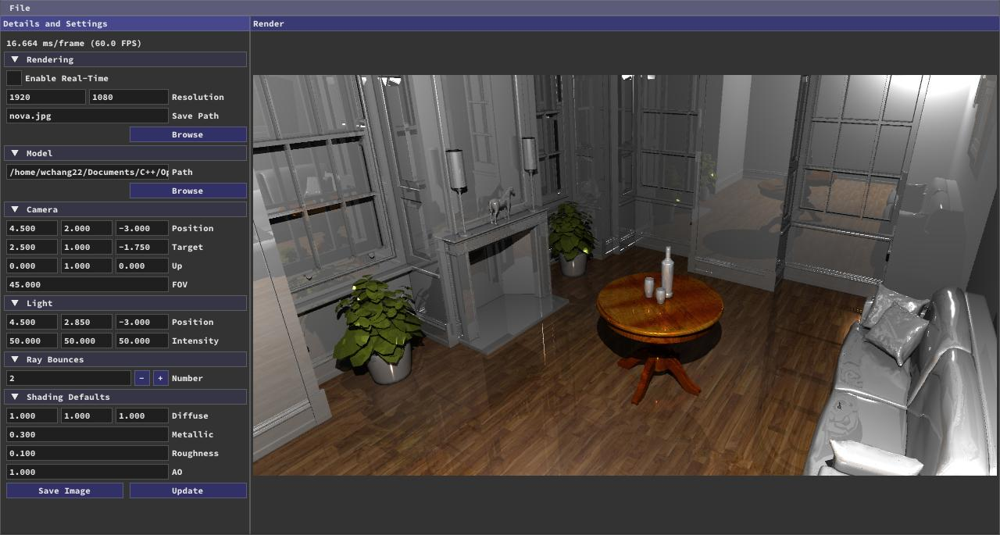
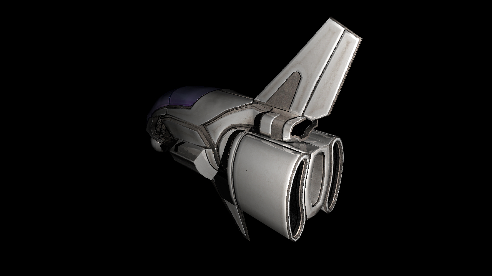

<h1 align='center'>Nova</h1>
<h3 align='center'>High performance GPU accelerated ray tracer using OpenCL/CUDA</h3>

## Examples
<p align="center">
  
</p>
<p align="center">
  
</p>
<p align="center">
  
</p>


## Dependencies For Building
* CMake
* OpenCL C++ or CUDA
* OpenMP
* OpenGL 3.3+
* GLFW dependencies (https://www.glfw.org/docs/3.3/compile.html#compile_deps)

## Build and Run

```bash
$ git clone https://github.com/wchang22/Nova.git
$ cd Nova && mkdir build && cd build
$ cmake .. -DBACKEND=OpenCL # or cmake .. -DBACKEND=CUDA
$ cmake --build .
$ ./nova
```

## Docker (For OpenCL)

```bash
$ cd Nova
$ docker build -t nova .
$ docker run -it --rm -v $(pwd):/root/nova --device /dev/dri:/dev/dri nova
$ cd Nova && mkdir build && cd build
$ cmake .. -DBACKEND=OpenCL
$ cmake --build .
$ ./nova --headless
```

