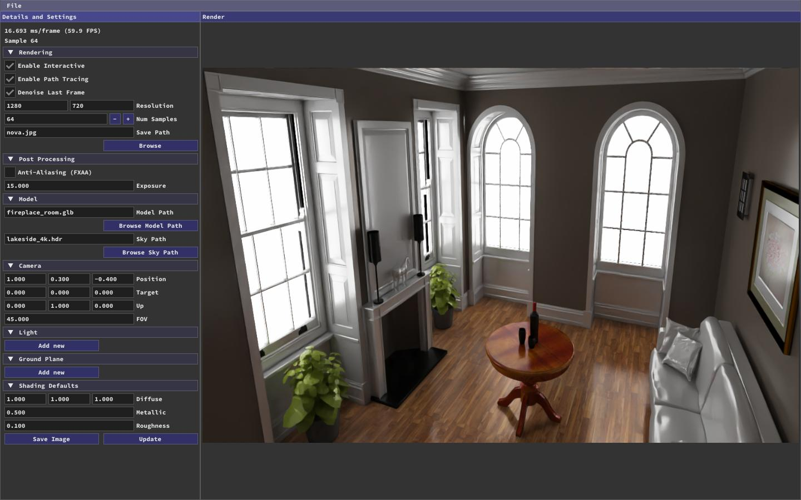
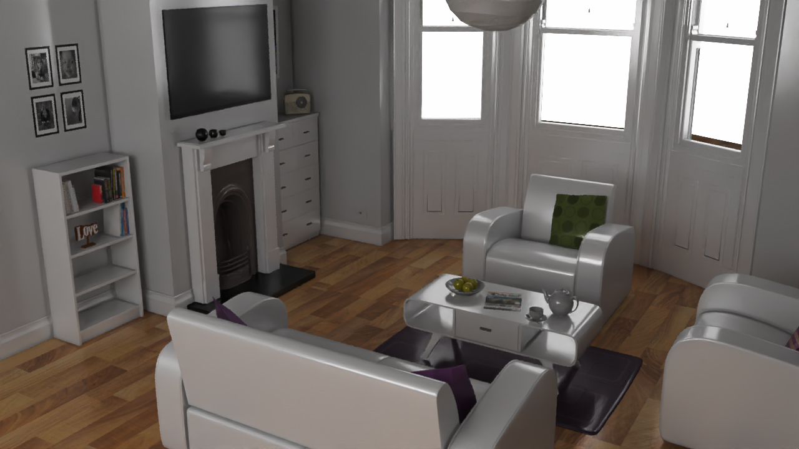
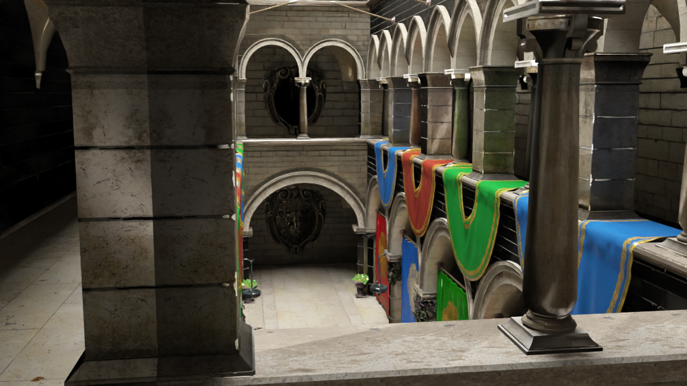

<h1 align='center'>Nova</h1>
<h3 align='center'>High performance GPU accelerated ray tracer using OpenCL/CUDA</h3>

## Examples
<p align="center">
  
</p>
<p align="center">
  
</p>
<p align="center">
  
</p>
<p align="center">
  
</p>

## Supported Operating Systems
* Linux
* Any operating system capable of running Linux Docker containers (though exposing the GPU and GUI may be tricky)

## Supported Hardware
Either:
* Any CPU or GPU supporting OpenCL 2.1+
* A CUDA-enabled GPU

## Dependencies For Building
Common:
* CMake 3.12+
* C++17
* OpenMP
* OpenGL 3.3+
* [GLFW dependencies](https://www.glfw.org/docs/3.3/compile.html#compile_deps)

OpenCL:
* OpenCL runtime for your device
* OpenCL C and C++ headers
* Clang 9+ with [LLVM/SPIR-V Translator](https://github.com/KhronosGroup/SPIRV-LLVM-Translator)

CUDA:
* NVIDIA drivers
* CUDA Toolkit

## Included Dependencies
* [Assimp](https://github.com/assimp/assimp)
* [GLFW](https://github.com/glfw/glfw)
* [Intel Open Image Denoise](https://www.openimagedenoise.org/downloads.html)
* [GLAD](https://github.com/Dav1dde/glad)
* [GLM](https://glm.g-truc.net/0.9.9/index.html)
* [Dear ImGui](https://github.com/ocornut/imgui)
* [ImGuiFileDialog](https://github.com/aiekick/ImGuiFileDialog)
* [toml11](https://github.com/ToruNiina/toml11)
* [CLI11](https://github.com/CLIUtils/CLI11)
* [stb](https://github.com/nothings/stb)

## Build and Run

```bash
$ git clone https://github.com/wchang22/Nova.git
$ cd Nova && mkdir build && cd build

# Either
$ export CC=/path/to/clang && export CXX=/path/to/clang++
$ cmake .. -DBACKEND=OpenCL
# Or
$ export CC=/path/to/gcc && export CXX=/path/to/g++
$ cmake .. -DBACKEND=CUDA

$ cmake --build .
$ ./nova # Add --headless to run without the GUI
```

## Suggested - Docker (For OpenCL)

```bash
$ cd Nova
$ docker build -t nova .
$ xhost local:root
$ docker run -it --rm --name nova -w /root/Nova/ -e DISPLAY \
  -v /tmp/.X11-unix:/tmp/.X11-unix -v $(pwd):/root/Nova \
  --device /dev/dri:/dev/dri nova
$ cd Nova && mkdir build && cd build
$ cmake .. -DBACKEND=OpenCL
$ cmake --build .
$ ./nova
```

