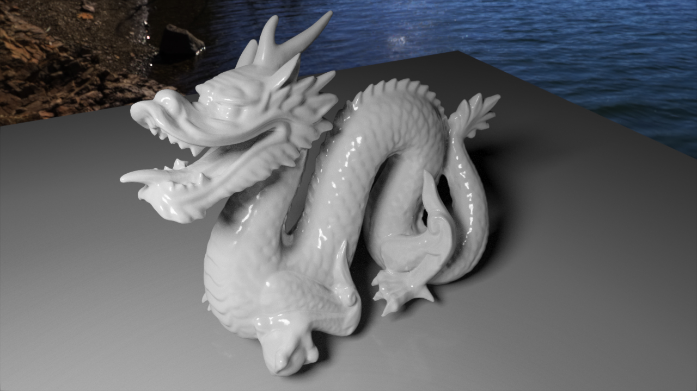

<h1 align='center'>Nova</h1>
<h3 align='center'>High performance GPU accelerated ray tracer using OpenCL</h3>

## Examples
<p align="center">
  
</p>
<p align="center">
  
</p>

## Dependencies
* CMake
* OpenCL
* OpenMP

## Build and Run
```bash
git clone --recurse-submodules https://github.com/wchang22/Nova.git
cd Nova && mkdir build && cd build
cmake .. && make
./nova
```